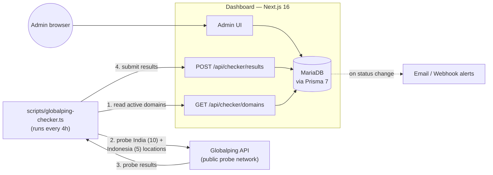

<p align="center">
  
</p>

<h1 align="center">Mi-Hawk Domain Radar</h1>

<p align="center">
  <b>Region-aware uptime monitoring for domain portfolios in India &amp; Indonesia.</b><br>
  Built and maintained by <b>DonPao</b>.
</p>

<p align="center">
  
  
  
  
  
</p>

---

Mi-Hawk answers a more useful question than "is the server up?" — *is the site reachable for the audience that actually matters, from where they actually are?*

A distributed probe network checks every domain from real locations across its target market. An admin dashboard turns those results into a single, actionable status per domain — with alerting, redirect-chain visualization, and full check history.

## Contents

- [Why region-aware monitoring matters](#why-region-aware-monitoring-matters)
- [Features](#features)
- [Architecture](#architecture)
- [Status model](#status-model)
- [Getting started](#getting-started)
- [Further documentation](#further-documentation)

---

## Why region-aware monitoring matters

A domain can be fully reachable from its target market while a CDN/WAF blocks a single probe — that shouldn't read as "Critical". Mi-Hawk's status model is built around this:

- **Per-region scoring** — each domain is scored only against its own target market (India: 10 locations, Indonesia: 5 locations), never a generic global average.
- **Blocked vs. down** — a request rejected by a CDN/WAF (`blocked`) is a checker-side signal, not a real outage, and is excluded from both sides of the up/down ratio.
- **Target-market-only baseline** — a domain's overall status is derived entirely from the region its audience is actually in. There's no secondary "global" checkpoint to falsely tank a domain's score over a transient probe hiccup somewhere irrelevant to its audience.

---

## Features

| Feature | Description |
| --- | --- |
| 📊 **Dashboard** | Fleet-wide summary (Healthy / Partial Issue / Critical) with recent activity feed |
| 🌐 **Domains** | Searchable directory with per-region breakdowns, target market, and pause controls |
| 🔀 **Redirect Map** | Visual chain map of 301/302 redirects and bridge pages (meta-refresh click-gates) across the portfolio |
| 📍 **Region Checks** | Live Leaflet/OpenStreetMap view of all 15 checkpoint locations and their current status |
| 🚨 **Incidents** | Severity-sorted feed of every down/blocked location across the portfolio |
| 🕓 **Check History** | Searchable, paginated 30-day timelog of every check performed by the fleet |
| 📄 **Reports** | Daily/monthly PDF and Excel exports |
| 📥 **Bulk Import** | Add or update large batches of domains from a CSV/text file, with an import log |
| 🔔 **Alert Settings** | Email and webhook notifications with per-domain severity escalation rules |
| ⚙️ **System Settings** | Check interval, retry count, request timeout, and checker API key rotation |

---

## Architecture



- **The dashboard never contacts monitored domains directly.** All reachability data comes from the checker.
- Checks run on a schedule (every 4 hours by default) via [`scripts/globalping-checker.ts`](scripts/globalping-checker.ts), which reads active domains from the database and probes each one through [Globalping](https://globalping.io)'s distributed network — no dedicated checker VPS required.
- Communication with the dashboard is a small authenticated API: the checker **pulls** the active domain list (`GET /api/checker/domains`) and **pushes** results (`POST /api/checker/results`).
- A legacy self-hosted checker (`checker-node/`, one Node.js process per checkpoint, managed with PM2) is still in the repo as an alternative to Globalping if you'd rather run your own probe fleet — see [DOCUMENTATION.md](DOCUMENTATION.md#7-checker) for both options.

| Layer | Stack |
| --- | --- |
| Dashboard | Next.js 16 (App Router, Turbopack), React 19, Tailwind CSS 4 |
| Database | MariaDB via Prisma 7 + `@prisma/adapter-mariadb` |
| Charts / Maps | Chart.js, Leaflet / react-leaflet |
| Reporting | jsPDF, ExcelJS |
| Checker | Scheduled Globalping API probe job (`scripts/globalping-checker.ts`), or a self-hosted PM2 fleet (`checker-node/`) |
| Auth | Session-based multi-admin authentication (cookie-based, configurable per-admin credentials) |

### Domain model

- `Domain` — monitored site: URL, target market (`india` / `indonesia`), active/paused flags.
- `CheckResult` — latest status per `(domain, region, location)`, upserted every cycle. Drives the dashboard.
- `CheckLog` — append-only history of every check, pruned after 30 days. Drives Check History.

---

## Status model

| Reachable | Status |
| --- | :---: |
| 100% |  |
| 70–99% |  |
| 30–69% |  |
| 1–29% |  |
| 0% |  |

Locations blocked by a CDN/WAF are excluded from both sides of the ratio — see [Why region-aware monitoring matters](#why-region-aware-monitoring-matters).

---

## Getting started

### Prerequisites

- Node.js 18+
- MariaDB 10.6+ (or MySQL 8+)

### Dashboard

```bash
npm install
cp .env.example .env   # set DATABASE_URL, ADMIN_USERNAME/PASSWORD, SESSION_SECRET, CHECKER_API_KEY
npx prisma migrate deploy
npm run dev
```

Visit `http://localhost:3000` and log in with the admin credentials from `.env`.

### Checker

The default checker is a scheduled script using the [Globalping](https://globalping.io) API — no separate deployment needed:

```bash
# set GLOBALPING_API_KEY_INDIA / GLOBALPING_API_KEY_INDONESIA in .env, then:
npm run checker:run
```

In production this runs as a PM2 cron job (see [`ecosystem.config.cjs`](ecosystem.config.cjs)) every 4 hours.

Prefer to run your own probe fleet instead? [`checker-node/`](checker-node/) is a standalone, self-hostable checker — one process per checkpoint:

```bash
cd checker-node
npm install
cp .env.example .env   # MAIN_SERVER_URL, CHECKER_API_KEY, NODE_NAME, REGION_NAME, LOCATION_NAME, TARGET_MARKET
npm start
```

`CHECKER_API_KEY` must match between the dashboard and every checker. `LOCATION_NAME` must match a name in [`data/checkpoints.ts`](data/checkpoints.ts) exactly — the dashboard matches results by that string.

---

## Further documentation

See [DOCUMENTATION.md](DOCUMENTATION.md) for the full technical reference — data model, status/scoring algorithm, checker internals, API contracts, configuration, alerting, and known limitations.

---

## License

No license is currently granted — all rights reserved. This repository is shared publicly for portfolio/demonstration purposes; contact the author before reusing any part of it.

---

> **Note for contributors:** This project runs on a Next.js fork with breaking API and convention changes from upstream. Read `node_modules/next/dist/docs/` and `AGENTS.md` before making changes.

<p align="center">© DonPao</p>
